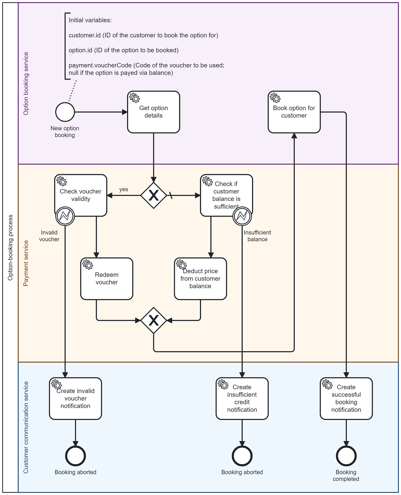

# BPMN Camunda-Demo
#### Janek Berg 2024
This repository contains a demonstration of the use of the [Business Process Model and Notation (BPMN)](https://www.omg.org/spec/BPMN/) with the BPMN process orchestration platform [Camunda 8](https://camunda.com/). It not only showcases how business processes can be modelled in a comprehensive manner with BPMN, but also how their activities can be linked to custom service implementations using Camunda.

The capabilities of BPMN and Camunda are demonstrated using a simplified option-booking process that could be used by mobile phone providers, for example. The BPMN model of the process is stored in `option_booking.bpmn` and looks as follows:


To inspect the BPMN process and its configurations in detail, it can be opened using the Camunda Modeler. The swimlanes used in the model divide the responsibility for the service tasks of the process between three services, which are implemented in their respective subdirectories:

* `option-booking-service` maintains a catalogue of all available options and creates and stores all option bookings by customers.
* `payment-service` keeps track of the balance of all customers as well as available vouchers and implements job workers for deducting balance and redeeming vouchers to pay for booked options.
* `customer-communication-service` manages notifications for the customer which are created when an option was successfully booked or an option booking failed.

## Prerequisites
To work with the process implementation, the following prerequisites need to be installed:
* Java 21
* Docker (latest version)
* [Camunda Modeler](https://camunda.com/download/modeler/)

## Usage
### Starting Camunda and all services
The Docker Compose configuration in `docker-compose.yaml` can be used to easily set up a local Camunda cluster, the services and their databases. It is divided into three profiles that can be used for separate purposes:
* `camunda` starts the Zeebe broker, the Camunda Operate component and the Elasticsearch database used by both.
* `databases` starts the PostgreSQL instances of the service implementations.
* `services` starts the services that implement the BPMN job workers for the option-booking process.
  * Before the images for the services can be built, it is important to perform the Maven build process of each service. This can be done via the provided scripts `build-services.ps1` (PowerShell) or `build-services.sh` (Shell) or by following the instructions in the `README` files of the services.

To start all profiles at once, the following command can be used:
```shell
docker compose --profile camunda --profile databases --profile services up -d --build
```

Once all containers have been started, it should be possible to deploy the process definition to Zeebe and start process instances via the Camunda Modeler. The Camunda Operate UI will be available on [http://localhost:8081](http://localhost:8081) and allows observing the state of all processes. The username and password for the login are `demo/demo`.

Furthermore, each service provides web pages displaying its currently stored data, which can be viewed on the ports `7000` (option-booking), `7001` (payment) and `7002` (customer-communication). For details, please refer to the `README` files of the services.

### Starting process instances
To demonstrate the execution of the process, new process instances can be started from the Camunda Modeler. The process expects the input variables which are annotated for the start event to be provided. To test the scenarios of successful bookings via balance or voucher, the following input values can be used:

#### Booking via balance
```json
{
  "customer": {
    "id": "0e1762d5-0b98-4755-97c1-759147499cc3"
  },
  "option": {
    "id": "b8356187-3f65-4625-ad10-2890ceec5cd3"
  }
}
```
#### Booking via voucher
```json
{
  "customer": {
    "id": "0e1762d5-0b98-4755-97c1-759147499cc3"
  },
  "option": {
    "id": "b8356187-3f65-4625-ad10-2890ceec5cd3"
  },
  "payment": {
    "voucherCode": "PE9CK0PL6G"
  }
}
```

Alternatively, the voucher code **VG38K9XMK4** can be used, too. The IDs and voucher codes used by the inputs are hard-coded in the test data creation scripts of the services to make the demonstration of the processes easier.

### Resetting the test data
Once the balance of the test customer is exceeded and all vouchers have been redeemed, booking another option will not be possible. To reset the data of all services, stop and delete the containers of the services and their databases. After restarting all containers, the system will be reset to its initial state.